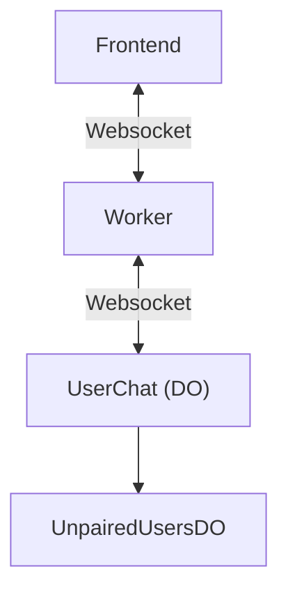

# meetup.ai

This project is an assignment for an internship at Cloudflare.
It contains an AI-enabled application allowing people to meet each other. After going to the [website](https://meetup-ai-app.user8192.workers.dev/), you introduce yourself to the AI, and then get paired with partners on the application, to have a chat.
Here is an example prompt to introduce yourself quickly in one go: `name is Zoe, last name is Zach, am 15, like rock climbing`
Key principles of the application:
- Ephemeral: no account system, you just introduce yourself, and get paired with another user. If you reset your browser, you lose your profile and have to create one again
- One chat: you don't have multiple chats with multiple people at the same time. The introduction ("sign-up"), and chatting with people all happen from a single chat window
- AI-enabled: you are signed-up by an LLM in an interactive way instead of going through a form

# Architecture

# Future improvements (TODO)
- Move away from the Agent SDK: while having integrated state is nice, the Agent SDK has limitations for this use cases. For examples, it requires you to re-send *all* chat messages back and forth on every message, instead of just sending the new message. Raw Websockets would probably be better
- Implement UserChat DO automatic deletion to avoid extra billing and stay true to the "ephemeral" principle, e.g. after 12 hours without activity. I didn't check much, but the destroy() method coupled with a schedule seems to solve this problem (Although the method [creates errors](https://community.cloudflare.com/t/cloudflare-agent-no-such-table-error-after-destroy-re-initialization/801288))
- Improve the frontend
- Scan the chat messages between users with an LLM, to provide suggestions (e.g. "Do you want to find another partner ?" after a negative message is sent)
- Use tools (function calling) instead of a dedicated LLM to fill the introduction data, for better results ?
- Get matched with online (with an active WebSocket connection) users first.

# Other
As part of this assignment, I also created some pull requests, and code snippets which I hope will help other people.

https://github.com/cloudflare/agents/pull/761 (I'd love a review !)
https://github.com/pinojs/sonic-boom/pull/236
https://gist.github.com/iTrooz/a2c3f0f50da2ec31d075ca751985ab4b 
https://gist.github.com/iTrooz/179e498d181f811ec6ebc30396a73f51 
https://stackoverflow.com/a/79857139/14632023 
